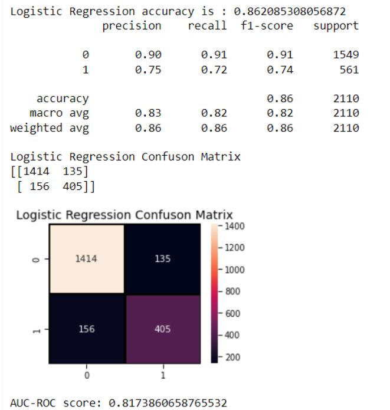

<h1 align="center">Customer-Churn-Prediction</h1>

<h3>Contents</h3>
1.Introduction
 
2.About the dataset
 
3.Research Questions
 
4.Data Cleaning
 
5.Exploratory Data Analysis
 
6.Evaluation of models
 
7.Insights and Recommendations
 
8.Conclusion
 
<h3>Introduction</h3>
Customer churn is when customers stop using a company's products or services, and it can be voluntary or involuntary. It is important for businesses to track customer churn because it can be costly to acquire new customers. Retaining customers can reduce churn and improve a company's bottom line.
<h3>About the dataset</h3>
The dataset -1 contains customer records associated with a European Telecom Company. The dataset -2 appears to contain information about customer support calls, with each row representing a single call.From the features provided, we can potentially analyze customer churn rate and service performance of the telecom company.The dataset is taken from:-
 
https://www.kaggle.com/datasets/datazng/telecom-company-churn-rate-call-center-data
 
<h3>Research Questions</h3>
Dataset-1
 
Q1.What is the overall churn rate of the telecom company and how does it vary by customer demographics?
 
Q2.Which services are most commonly subscribed to by customers?
 
Q3.What are the factors affecting?
 
 
Dataset-2
 
Q1.What is the overall satisfaction rate of customers?
 
Q2.Which topics have the highest and lowest resolution rates? 
 
Q3.What is the average speed of answer for different topics and agents?
 
Q4.Which agents have the highest and lowest resolution rates?
 
Q5.What is the overall satisfaction rating for calls related to Admin Support?
 
Q6.What is the overall satisfaction rating for calls related to Tech Support?
<h3>Data Cleaning</h3>
To ensure that our dataset was of good quality, we first explored the data to understand its columns and contents. The dataset contained 7043 rows and 23 columns of numerical and categorical data. Dataset -2 contains 10 columns and 4054 rows. We identified missing values and duplicates and removed them from the dataset. We also performed some preprocessing on Dataset-1, including handling outliers, dealing with categorical variables, and normalizing or scaling numerical data, depending on our research questions and the dataset's specific characteristics.
<h3>Exploratory data analysis</h3>

<h3>Evaluation on the performance of machine learning models</h3>

Based on the evaluation results, the best performing models in terms of accuracy are the Random Forest Classifier and the Logistic Regression Classifier with accuracy scores of 0.86.It is also important to consider other metrics such as precision, recall, and F1-score in addition to accuracy to better evaluate the models' performance. Based on the precision, recall and F1-score, the best model is Logistic Regression, with a precision of 0.75 and recall of 0.72 for identifying the churned customers. The Random Forest Classifier also performed well, with a precision of 0.79 and recall of 0.64. However, it's worth noting that the performance of the models might vary based on the specific needs of the problem and the costs associated with false positives and false negatives.The area under the ROC curve (AUC-ROC) score is also a useful metric to evaluate the models' ability to distinguish between the positive and negative classes.The Logistic Regression model has a higher AUC-ROC score compared to the Random Forest Classifier, indicating that the Logistic Regression model has a better overall performance in terms of correctly identifying true positive and true negative cases.
<h3>Recommendations</h3>
<h3>Conclusions</h3>

-----

**✍️ Blog Posts :**

COMING SOON

